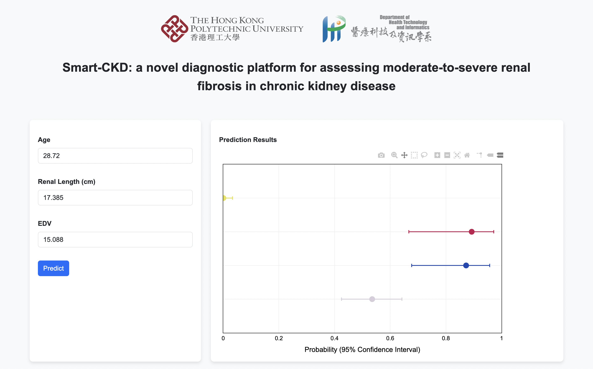

# Smart-CKD: a novel diagnostic platform for assessing moderate-to-severe renal fibrosis in chronic kidney disease [[Paper](https://www.academicradiology.org/article/S1076-6332(23)00091-0/fulltext)] [[Demo](https://polyustar.github.io/ckd)]

